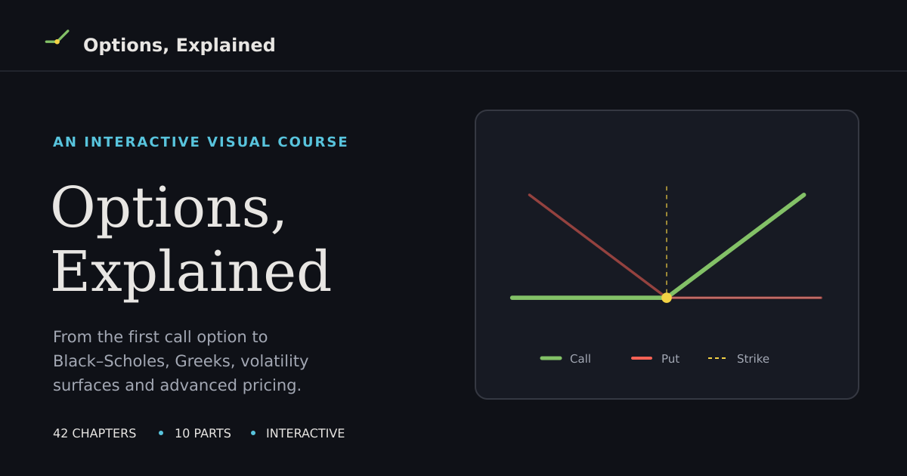

# Options, Explained

**An interactive, visual course on financial options—from your first call and put to stochastic volatility, numerical pricing, and martingale theory.**

Options become easier to understand when you can *see* how they work. Start with an intuitive example, explore what changes when you move a slider, and then discover the mathematics behind it. The course builds from first principles to graduate-level derivatives theory, without skipping the steps in between.

**[Explore the interactive course →](https://jesusvillota.github.io/options-explained/)** · [Start with Chapter 1](https://jesusvillota.github.io/options-explained/chapters/01-what-is-an-option/)

## Understand the *why*, not just the formula

- **See the intuition.** Begin with a concrete financial problem and a visual explanation, before introducing notation.
- **Experiment yourself.** Change strikes, volatility, time to expiry, or hedging frequency and watch the consequences unfold in interactive diagrams and simulations.
- **Build the mathematics step by step.** Move from payoff diagrams to replication arguments, stochastic calculus, pricing formulas, and numerical methods.
- **Check your understanding.** Apply the ideas through practical examples, interactive exercises, and short quizzes.

## What you'll learn

The course contains **73 chapters in 16 progressively more advanced parts**: ten on pricing and hedging in a frictionless market, and six on market microstructure, how options actually trade. Start without mathematical prerequisites, or jump to a topic you want to understand more deeply. Chapters still being written are marked *coming soon*.

| Part | Explore |
| --- | --- |
| **I. What options are** | [Calls, puts, payoffs, moneyness, and option strategies](https://jesusvillota.github.io/options-explained/chapters/01-what-is-an-option/) |
| **II. No-arbitrage reasoning** | [Forwards, pricing bounds, put–call parity, and early exercise](https://jesusvillota.github.io/options-explained/chapters/06-time-value-and-forwards/) |
| **III. Pricing in discrete time** | [Replication, risk-neutral probabilities, and binomial trees](https://jesusvillota.github.io/options-explained/chapters/11-one-period-binomial/) |
| **IV. Continuous time** | [Brownian motion, Itô's lemma, and Black–Scholes](https://jesusvillota.github.io/options-explained/chapters/15-brownian-motion/) |
| **V. Greeks & hedging** | [Delta, gamma, theta, vega, and dynamic hedging](https://jesusvillota.github.io/options-explained/chapters/21-delta-gamma/) |
| **VI. Volatility** | [Implied volatility, smiles and skew, volatility surfaces, and VIX](https://jesusvillota.github.io/options-explained/chapters/25-historical-implied-vol/) |
| **VII. Beyond Black–Scholes** | [Local volatility, Heston, jumps, SABR, and rough volatility](https://jesusvillota.github.io/options-explained/chapters/29-local-volatility/) |
| **VIII. Numerical methods** | [Monte Carlo, finite differences, Fourier pricing, and American options](https://jesusvillota.github.io/options-explained/chapters/33-monte-carlo/) |
| **IX. Exotic & multi-asset options** | [Exotic payoffs, path dependence, and multi-asset derivatives](https://jesusvillota.github.io/options-explained/chapters/37-path-independent-exotics/) |
| **X. Deep theory & applications** | [Martingale pricing, interest-rate options, credit, and real options](https://jesusvillota.github.io/options-explained/chapters/40-martingale-pricing/) |
| **XI. Inside the options market** | [Order books, matching rules, auctions, clearing and margin, liquidity, and arbitrage with frictions](https://jesusvillota.github.io/options-explained/chapters/43-limit-order-book/) |
| **XII. Information and price formation** | [Inventory, Glosten–Milgrom, Kyle's model, informed trading and price discovery](https://jesusvillota.github.io/options-explained/chapters/49-inventory/) |
| **XIII. The options market maker** | [Building a surface from quotes, quoting, Avellaneda–Stoikov, book risk, hedging with costs, and demand-based pricing](https://jesusvillota.github.io/options-explained/chapters/55-noisy-quotes-surface/) |
| **XIV. Price impact and optimal execution** | [The square-root law, Almgren–Chriss, transient impact, execution algorithms, and executing option trades](https://jesusvillota.github.io/options-explained/chapters/61-price-impact/) |
| **XV. When hedging moves the market** | Dealer gamma, pinning, zero-day options, and liquidity spirals (*coming soon*) |
| **XVI. High-frequency microstructure** | Hawkes processes, queues and the microprice, microstructure noise, and market design (*coming soon*) |

[**Browse the full course →**](https://jesusvillota.github.io/options-explained/)

## Who is it for?

Whether you are **new to options**, studying **finance or economics**, or working with **derivatives and quantitative models**, the course is designed to let you start at the right level and build understanding at your own pace. Introductory chapters need no advanced mathematics; later chapters include full mathematical derivations.

## Start exploring

You don't need to install anything. Open the course in your browser, choose a chapter, and interact with the figures as you learn.

**[Start learning Options, Explained →](https://jesusvillota.github.io/options-explained/)**

## License

*Options, Explained* is available under two complementary licenses:

- **Course content:** Original explanations, derivations, exercises, and illustrations are licensed under [Creative Commons Attribution 4.0 International (CC BY 4.0)](LICENSE-CONTENT.md). You may reuse and adapt them, including commercially, with appropriate credit.
- **Source code:** Interactive components, pricing libraries, and site code are licensed under the [MIT License](LICENSE).

See the linked license files for scope, attribution guidance, and third-party exceptions.
